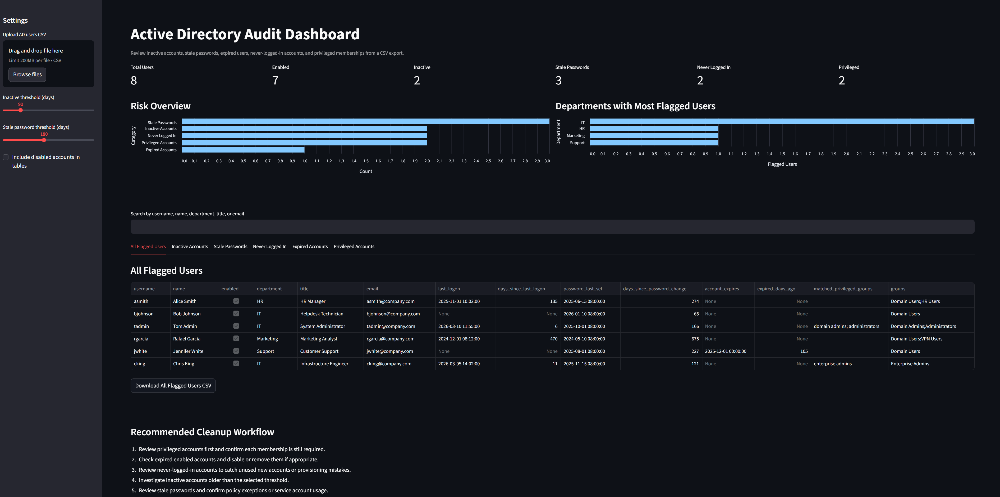

# Active Directory Audit Dashboard
A lightweight Python and Streamlit dashboard for auditing exported Active Directory user data.
This tool analyzes an exported CSV of AD users and identifies common directory hygiene and security issues such as inactive accounts, stale passwords, expired accounts, and privileged group memberships.
The goal of this project is to provide a simple internal tool for visualizing directory risk and prioritizing cleanup tasks.
---
## Dashboard Screenshot

## Features
The dashboard identifies and visualizes:
- Inactive accounts
- Stale passwords
- Never-logged-in users
- Expired accounts
- Privileged group memberships
It also provides:
- Risk overview charts
- Department-level breakdown of flagged accounts
- Search functionality for users
- Downloadable CSV reports for each issue category
---
## Dashboard Overview
The dashboard includes:
**Summary Metrics**
- Total users
- Enabled users
- Inactive accounts
- Stale passwords
- Never logged in users
- Privileged accounts
**Charts**
- Risk overview across audit categories
- Departments with the most flagged users
**Audit Tables**
- All flagged users
- Inactive accounts
- Stale passwords
- Never logged in
- Expired accounts
- Privileged accounts
Each table can be exported to CSV for further investigation.
---
## Sample Data
This repository includes a **synthetic sample dataset** (`ad_users_sample.csv`) that simulates an exported Active Directory user report.
No real directory data is included.
Typical fields used:
- SamAccountName
- Name
- Enabled
- LastLogonDate
- PasswordLastSet
- AccountExpirationDate
- MemberOf
- Department
- Title
- EmailAddress
---
## Installation
Clone the repository:
```bash
git clone https://github.com/yourusername/ad-audit-dashboard.git
cd ad-audit-dashboard
```

